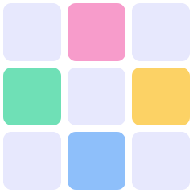
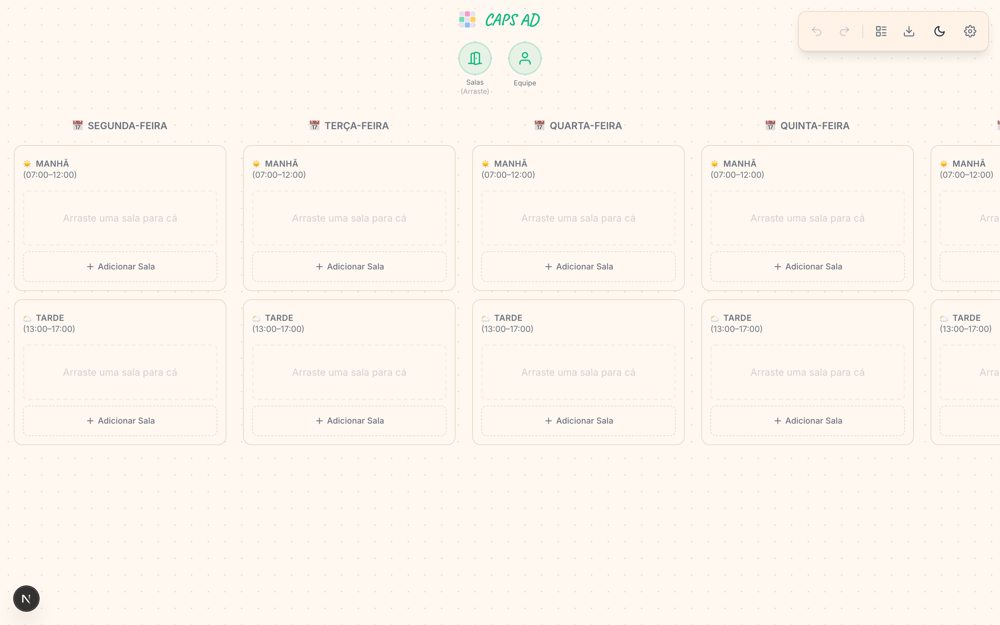
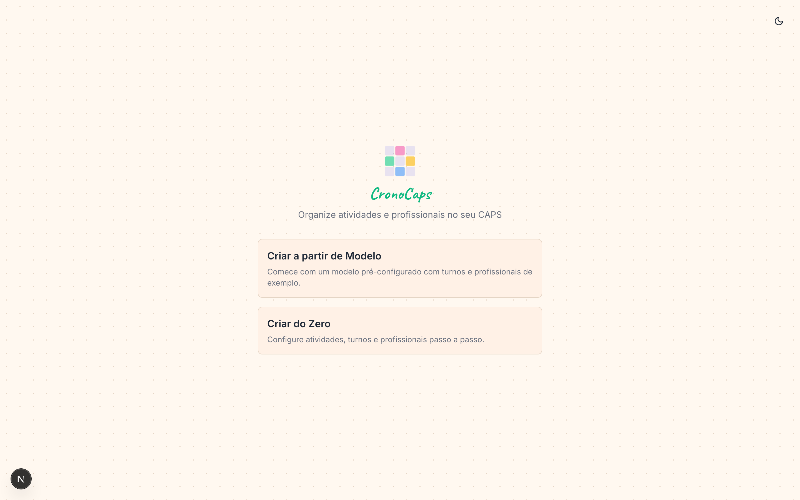
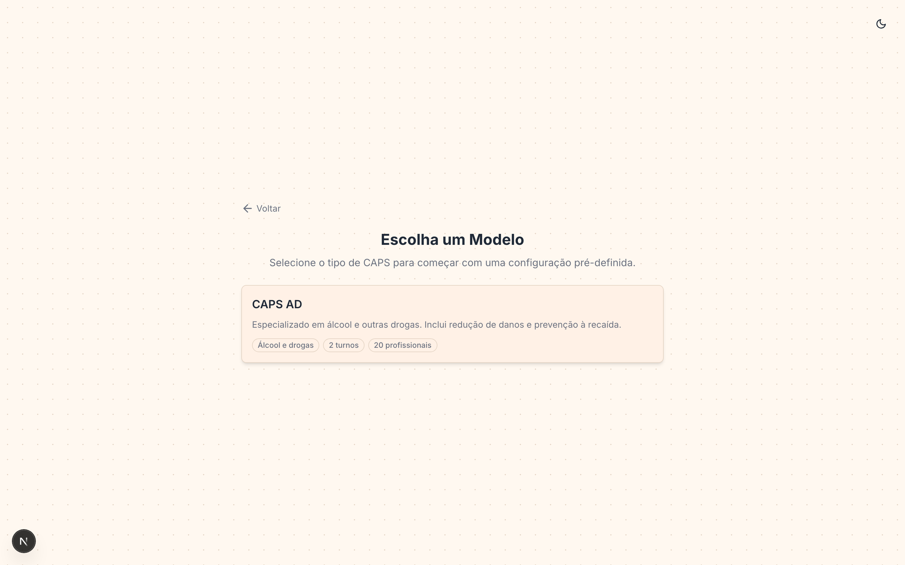
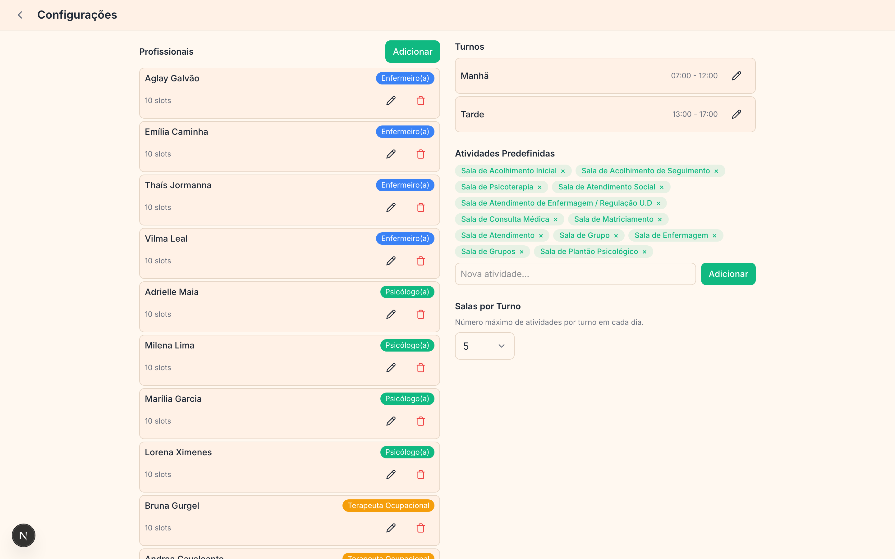
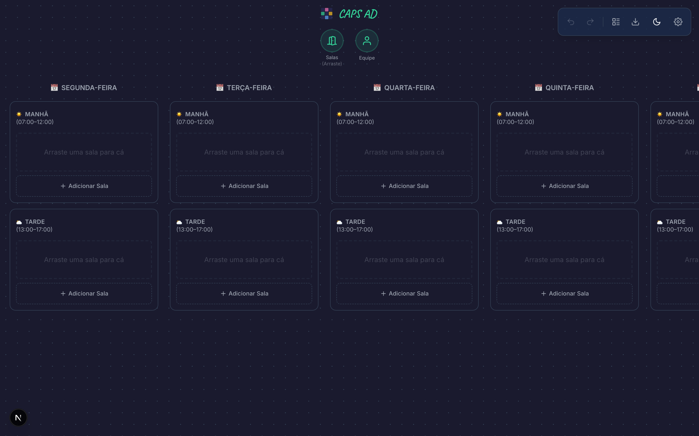
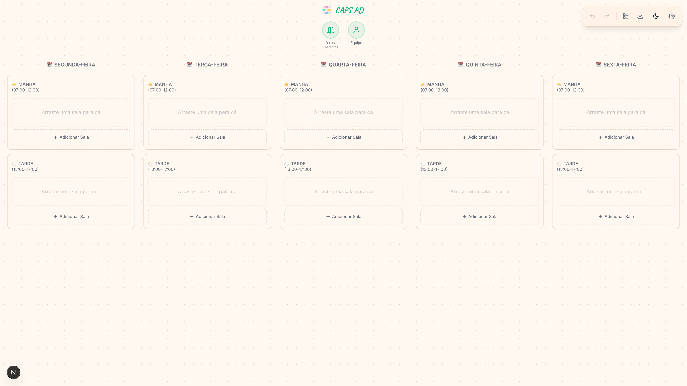

<p align="center">
  
</p>

<h1 align="center">CronoCaps</h1>

Ferramenta visual para organizar a grade semanal de atividades e profissionais em unidades **CAPS** (Centros de Atenção Psicossocial). Monte turnos, salas e equipes com drag-and-drop, valide conflitos em tempo real e exporte tudo em PDF.

> **Idioma da interface:** Português (BR)



<details>
<summary>Mais capturas de tela</summary>

### Tela inicial



### Seleção de modelo



### Configurações (profissionais, turnos, atividades)



### Modo escuro



### Visão ampliada



</details>

---

## Funcionalidades

- **Quadro semanal** com dias e turnos configuráveis (manhã, tarde, etc.)
- **Drag-and-drop** de salas/atividades entre turnos e dias
- **Gestão de profissionais** por categoria com cores (Enfermagem, Psicologia, Medicina, etc.)
- **Disponibilidade** por dia e turno para cada profissional
- **Validação de conflitos** em tempo real:
  - Profissional escalado em duas salas no mesmo turno
  - Sala acima da capacidade
  - Profissional indisponível
  - Conflito acolhimento inicial / seguimento
- **Modelos prontos** para diferentes tipos de CAPS (CAPS AD, etc.)
- **Assistente de criação** passo-a-passo para montar do zero
- **Exportação PDF** com grade completa, resumo de ocupação e relatório de conflitos
- **Copiar e colar** salas entre turnos/dias
- **Desfazer / refazer** (Ctrl+Z / Ctrl+Shift+Z)
- **Auto-save** em localStorage
- **Tema claro e escuro**
- **Responsivo** para desktop

## Stack

| Camada | Tecnologia |
|---|---|
| Framework | Next.js 16 (App Router) |
| UI | React 19, Tailwind CSS 4 |
| Drag & Drop | dnd-kit |
| PDF | jsPDF + jspdf-autotable |
| Ícones | Lucide React |
| Linguagem | TypeScript 5 |

## Primeiros passos

```bash
# Instalar dependências
npm install

# Rodar em desenvolvimento
npm run dev
```

Abra [http://localhost:3000](http://localhost:3000) e escolha um modelo ou crie sua grade do zero.

## Estrutura do projeto

```
src/
├── app/                    # Páginas (Next.js App Router)
│   ├── page.tsx            # Tela inicial
│   └── area-de-trabalho/   # Quadro + configurações
├── components/
│   ├── board/              # Quadro semanal, colunas, painéis
│   ├── dnd/                # Componentes de drag-and-drop
│   ├── export/             # Gerador de PDF e modal de exportação
│   └── ui/                 # Botões, cards, modais, toast, tema
├── features/
│   ├── professionals/      # CRUD de profissionais e categorias
│   ├── rooms/              # Salas e atividades
│   ├── schedule/           # Lógica de alocação
│   ├── validation/         # Detecção de conflitos
│   └── workspace/          # Modelos, wizard, persistência
├── hooks/                  # useUndoRedo, useLocalStorage
├── contexts/               # Clipboard (copiar/colar salas)
├── lib/                    # Utilitários e constantes
└── types/                  # Interfaces TypeScript
```

## Licença

Este projeto ainda não possui uma licença definida.
